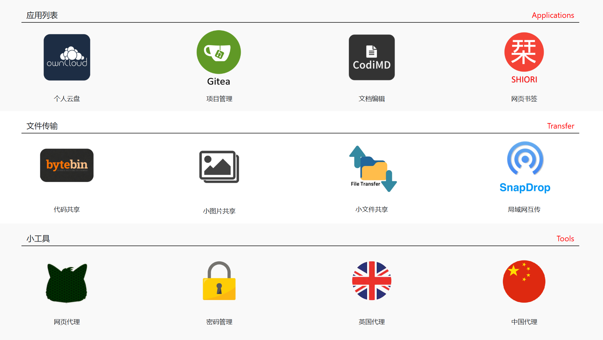

## Docker Swarm

> [!NOTE]
> This tutorial uses Docker Swarm, here's another tutorial that uses [k3s](https://github.com/wuhanstudio/app-k3s-cluster).
 
| Category           | Service                             | BiliBili                                             | YouTube                                                                                              |
| ------------------ | ----------------------------------- | ---------------------------------------------------- | ---------------------------------------------------------------------------------------------------- |
| Cloud Services     | Overview                            | [Link](https://www.bilibili.com/video/BV1qrWbzHEaT)  | [Link](https://www.youtube.com/watch?v=8znuiOSoADA&list=PLlRCv8NaDaU9mvICSXa9W4TNq_-ui89f8&index=1)  |
| Cloud Services     | Public Cloud (AWS / GCP / Azure)    | [Link](https://www.bilibili.com/video/BV1FzktBUEKf)  | [Link](https://www.youtube.com/watch?v=ADUykDR-UdY&list=PLlRCv8NaDaU9mvICSXa9W4TNq_-ui89f8&index=2)  |
| Cloud Services     | Private Cloud (OpenStack / Proxmox) | [Link](https://www.bilibili.com/video/BV1bpk8BMEha)  | [Link](https://www.youtube.com/watch?v=-F-v3KX773c&list=PLlRCv8NaDaU9mvICSXa9W4TNq_-ui89f8&index=3)  |
|                    |                                     |                                                      |                                                                                                      |
| Cluster Management | GoTask                              | [Link](https://www.bilibili.com/video/BV1TYwczqEVH)  | [Link](https://www.youtube.com/watch?v=hk7H1sJolug&list=PLlRCv8NaDaU9mvICSXa9W4TNq_-ui89f8&index=4)  |
| Cluster Management | Traefik                             | [Link](https://www.bilibili.com/video/BV1ADwjz3Eo5)  | [Link](https://www.youtube.com/watch?v=5SCIViaUOGY&list=PLlRCv8NaDaU9mvICSXa9W4TNq_-ui89f8&index=5)  |
| Cluster Management | Docker vs K3S                       | [Link](https://www.bilibili.com/video/BV1854PzCEPW)  | [Link](https://www.youtube.com/watch?v=DkUDEkV58Bs&list=PLlRCv8NaDaU9mvICSXa9W4TNq_-ui89f8&index=6)  |
| Cluster Management | Docker                              | [Link](https://www.bilibili.com/video/BV1AJDTBnEbE/) | [Link](https://www.youtube.com/watch?v=c7V4FIQgL5c&list=PLlRCv8NaDaU9mvICSXa9W4TNq_-ui89f8&index=7)  |
| Cluster Management | K3S                                 | [Link](https://www.bilibili.com/video/BV1caD3BZEH8/) | [Link](https://www.youtube.com/watch?v=3ECi5LghaRM&list=PLlRCv8NaDaU9mvICSXa9W4TNq_-ui89f8&index=8)  |
|                    |                                     |                                                      |                                                                                                      |
| Utility Services   | Womginx (VPN)                       | [Link](https://www.bilibili.com/video/BV1PcoiBmE7s/) | [Link](https://www.youtube.com/watch?v=esKmLodYBhE&list=PLlRCv8NaDaU9mvICSXa9W4TNq_-ui89f8&index=9)  |
| Utility Services   | WireGuard (VPN)                     | [Link](https://www.bilibili.com/video/BV15RoCB9EtT/) | [Link](https://www.youtube.com/watch?v=PABBGE8-8zA&list=PLlRCv8NaDaU9mvICSXa9W4TNq_-ui89f8&index=10) |
| Utility Services   | Nginx (Homepage)                    | [Link](https://www.bilibili.com/video/BV1jNR7BLEEs/) | [Link](https://www.youtube.com/watch?v=s0rcmkY1Umw&list=PLlRCv8NaDaU9mvICSXa9W4TNq_-ui89f8&index=11) |
|                    |                                     |                                                      |                                                                                                      |
| Applications       | Linx                                |                                                      |                                                                                                      |
| Applications       | ByteBin                             |                                                      |                                                                                                      |
| Applications       | Dozzle                              |                                                      |                                                                                                      |
| Applications       | OwnCloud                            |                                                      |                                                                                                      |
| Applications       | Gitea                               |                                                      |                                                                                                      |
| Applications       | CodiMD                              |                                                      |                                                                                                      |
| Applications       | Ackee                               |                                                      |                                                                                                      |
| Applications       | Matomo                              |                                                      |                                                                                                      |



## Prerequisites

```
curl -1sLf 'https://dl.cloudsmith.io/public/task/task/setup.deb.sh' | sudo -E bash
```

```
sudo apt install task
```
